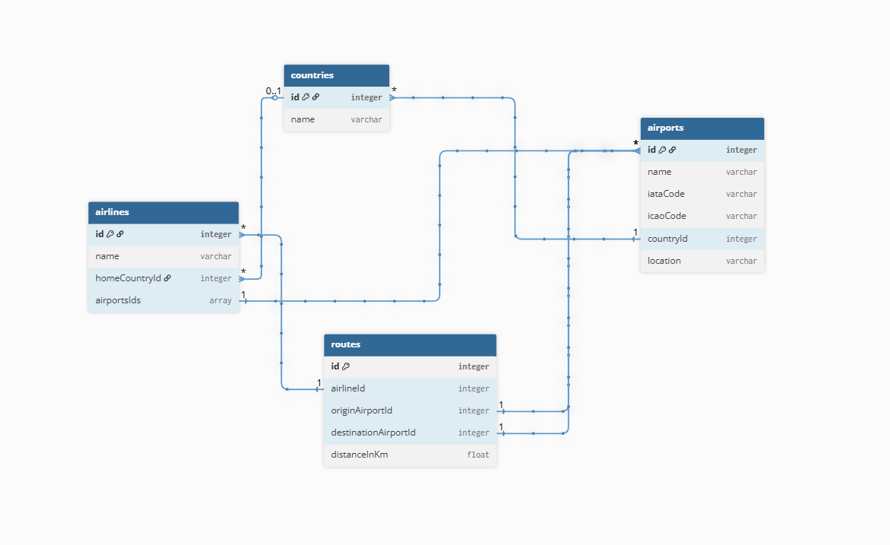

#  Travel Hub - Airline Route Management System

A comprehensive full-stack web application for managing **airlines**, **airports**, **routes**, and **countries** with interactive map visualization.  
Built with **React**, **Node.js**, **Express**, and **MongoDB**.

---

##  Live Demo
🔗 [Travel Hub Live](https://travel-hub-indol.vercel.app/)

> ⚠️**Note:** Backend may take 30–50 seconds to wake up on the first request (free Render tier limitation).

##  Table of Contents
- [Features](#-features)
- [Demo](#-demo)
- [Database relationships](#️-database-relationships)
- [Tech Stack](#️-tech-stack)
- [API Endpoints](#-api-endpoints)
- [Authentication & Authorization](#-authentication-&-authorization)

---

## Features

###  Core Functionality
- **Interactive Dashboard** – Real-time statistics and visual analytics  
- **Google Maps Integration** – Interactive map showing all airports with clickable markers  
- **Airline Management** – Full CRUD with country associations  
- **Airport Management** – Create, update, and delete airports with automatic geocoding  
- **Route Management** – Define routes with automatic distance calculation using *Geolib*  
- **Country Management** – Organize and filter data by countries  
- **Soft Delete** – Safe deletion with restore option  
- **Advanced Filtering** – Filter routes by airline or airports by country  

###  Technical Highlights
- **User Authentication & Authorization** – Secure login, register, and protected endpoints using JWT & cookies
- **HTTP-Only Cookies** – Tokens securely stored to prevent XSS
- **Token Validation Middleware** – Protects sensitive routes
- **Real-time Updates** – Instant data refresh after operations  
- **Automatic Distance Calculation** – Uses Haversine formula for accuracy  
- **Data Validation** – Comprehensive validation (frontend + backend)  
- **Responsive Design** – Optimized for both desktop and mobile  
- **Automatic Deployment** – CI/CD pipeline with GitHub integration  
- **Cloud Infrastructure** – Fully deployed on modern cloud platforms  

---

##  Demo

### 🔗 Live Application
[https://travel-hub-indol.vercel.app/](https://travel-hub-indol.vercel.app/)

## Database relationship

## Tech Stack

###  Frontend
- React 18 – UI library  
- Vite – Build tool and dev server  
- React Router – Client-side routing  
- Axios – HTTP client for API requests  
- React Responsive Modal – Modal dialogs  
- React Select – Enhanced dropdowns  
- @react-google-maps/api – Google Maps integration  
- React Loading Indicators – Loading animations  
- SweetAlert2 – Alert notifications  

### Backend
- Node.js – JavaScript runtime  
- Express.js – Web framework  
- MongoDB – NoSQL database  
- Mongoose – ODM for MongoDB  
- Geolib – Geographic distance calculations  
- Axios – HTTP client for Google Geocoding API  
- dotenv – Environment variable management  
- CORS – Cross-origin resource sharing  

### Cloud & Deployment
- **Vercel** – Frontend hosting  
- **Render** – Backend hosting  
- **MongoDB Atlas** – Cloud database  
- **GitHub** – Version control & CI/CD  

### External APIs
- Google Maps JavaScript API – Interactive maps  
- Google Geocoding API – Airport location coordinates  

## Authentication & Authorization
### Overview
The app uses JWT-based authentication with secure HTTP-only cookies.
Users can register, log in, and stay authenticated between sessions.
Protected API routes require a valid token for access.

## Auth Flow
1. User registers or logs in
2. Server hashes password using bcrypt
3. Server signs a JWT token with userId and sets it in a secure cookie
4. Cookie is automatically sent with withCredentials: true in all API calls
5. Middleware validates the token before granting access

###  Auth Endpoints
| Method | Endpoint | Description |
|--------|---------|-------------|
| POST | `/login` | Register or login (based on action field) |
| GET | `/logout` | Clear JWT cookie and logout user |
| GET | `/check-auth` | Validate current session / token |

##  API Endpoints

###  Airlines
| Method | Endpoint | Description |
|--------|---------|-------------|
| GET | `/get-all-airlines` | Get all airlines |
| GET | `/get-all-airlines?airlineId=ID` | Get specific airline by ID |
| POST | `/create-airline` | Create new airline |
| PUT | `/update-airline` | Update airline |
| PUT | `/delete-airline/:id` | Soft delete airline |

###  Airports
| Method | Endpoint | Description |
|--------|---------|-------------|
| GET | `/get-airports` | Get all airports |
| GET | `/get-airports?countryId=ID` | Filter airports by country |
| POST | `/create-airport` | Create new airport |
| PUT | `/update-airport/:id` | Update airport |
| PUT | `/delete-airport/:id` | Soft delete airport |

###  Routes
| Method | Endpoint | Description |
|--------|---------|-------------|
| GET | `/get-all-routes` | Get all routes |
| GET | `/get-all-routes?airlineId=ID` | Filter routes by airline |
| GET | `/get-all-routes?includeDeleted=true` | Include deleted routes |
| POST | `/create-route` | Create new route |
| PUT | `/update-route` | Update route |
| PUT | `/delete-route/:id` | Soft delete route |

###  Dashboard
| Method | Endpoint | Description |
|--------|---------|-------------|
| GET | `/get-all-lengths` | Get entity counts |
| GET | `/get-maps-config` | Get Maps API config |
| GET | `/get-all-countries-airports` | Get countries & airports |

